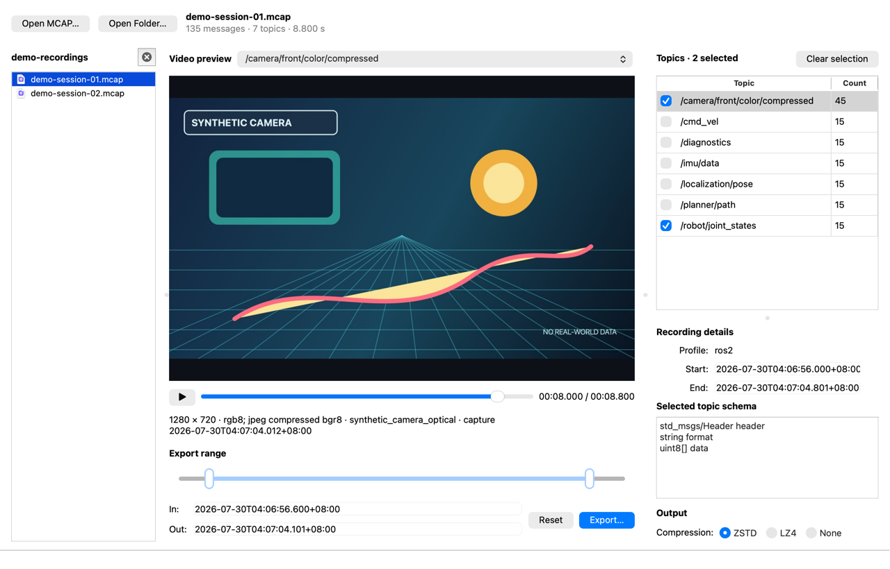

# MCAP Slice

[English](README.md) · [简体中文](README.zh-CN.md)

MCAP Slice 是一款独立桌面应用，用于可视化裁剪 MCAP 录制文件，并只导出需要的
话题。它在同一个原生 Qt 界面中提供类似视频剪辑的时间范围编辑、精确的 RFC
3339 时间戳、文件夹录制导航、话题过滤和可追溯的输出 Metadata。

应用基于 Qt 6 和 MCAP C++ 库构建，安装和运行都不需要 ROS。



## 下载

请从 [GitHub Releases](https://github.com/TANG617/MCAP-Slice/releases)
下载与你的平台匹配的安装包。

| 平台 | 安装包 |
| --- | --- |
| macOS 12 或更高版本，Apple Silicon | arm64 macOS DMG |
| macOS 12 或更高版本，Intel | x86_64 macOS DMG |
| Windows，x86_64 | Windows 桌面安装包 |
| Ubuntu，x86_64 | AppImage |

本文档不绑定具体发布版本或文件名，请按照平台和处理器架构选择对应产物。

## 快速开始

1. 打开单个 MCAP、将文件拖入窗口，或者打开一个包含多个 `.mcap` 文件的文件夹。
2. 设置 **In** 和 **Out** 时间并勾选需要导出的话题。视频预览选择与导出选择
   相互独立。
3. 选择 Zstandard、LZ4 或不压缩，然后点击 **Export…**。

MCAP Slice 使用原子方式写入新文件，并且拒绝覆盖源录制文件。

## 主要功能

- 拖动类似视频剪辑的 In/Out 手柄，或粘贴精确的绝对时间。
- 统一以 `Asia/Shanghai` 时区显示 RFC 3339 时间，例如
  `2026-07-30T04:06:56.682+08:00`。
- 接受带 `Z` 或其他 UTC 偏移的时间，并将同一时刻转换为 `+08:00`。
- 按需预览 Qt 可以解码的 ROS 2 CDR
  `sensor_msgs/msg/CompressedImage`，无需把所有图像载入内存。
- 浏览文件夹第一层并快速切换其中的 MCAP。
- 在当前文件夹会话内，跨文件保留明确选中的话题名称。
- 同步选择同一文件中具有相同 topic 名称的多个 channel。
- 使用 Zstandard、LZ4 或不压缩方式导出。
- 保留 schema、channel、channel Metadata 和源顶层 Metadata。
- 追加 `mcap_slice.provenance.v1` Metadata，让每次裁剪都能追溯到直接来源。
- 跟随桌面的原生浅色或深色外观。

## 时间与选择语义

- 每次新建单文件或文件夹会话时，话题都默认全部未选中。
- **Out** 是右开边界：时间恰好等于 Out 的消息不会导出。
- 编辑器使用毫秒精度；provenance 同时无损保存源录制的原始纳秒边界。
- 选择视频预览流不会自动勾选对应导出话题。

完整操作流程和常见错误请参阅[用户指南](docs/USER_GUIDE.zh-CN.md)。

## 支持的数据与当前限制

无论是否安装 ROS，MCAP Slice 都可以裁剪和复制普通 MCAP 消息 channel。视频
预览的条件更严格：channel 必须使用 ROS 2 CDR 编码，schema 必须是
`sensor_msgs/msg/CompressedImage`，并且压缩载荷需要能被 Qt 解码，例如 JPEG。

MCAP attachments 当前不会被复制。完成导出并确认结果符合工作流要求之前，请保留
源录制文件。

文件夹浏览不递归，只显示所选文件夹第一层中的 `.mcap` 文件。

## 文档

- [用户指南](docs/USER_GUIDE.zh-CN.md)
- [从源码构建](docs/BUILDING.md)
- [Provenance Metadata](docs/PROVENANCE.md)
- [开发与架构](docs/DEVELOPMENT.md)
- [变更日志](CHANGELOG.md)
- [参与贡献](CONTRIBUTING.md)
- [获取支持](SUPPORT.md)
- [安全策略](SECURITY.md)
- [第三方许可说明](THIRD_PARTY_NOTICES.md)

## 从源码构建

MCAP Slice 需要支持 C++17 的编译器、CMake 和 Qt 6 Widgets。应用所需的 MCAP、
LZ4 和 Zstandard 源码已经包含在仓库中。

```bash
cmake -S . -B build -DCMAKE_BUILD_TYPE=Release
cmake --build build --parallel
ctest --test-dir build --output-on-failure
```

各平台的前置条件和详细命令请参阅[从源码构建](docs/BUILDING.md)。

## 社区与许可

已经确认的 Bug 和功能建议请提交到
[GitHub Issues](https://github.com/TANG617/MCAP-Slice/issues)。提问前请阅读
[支持说明](SUPPORT.md)，安全漏洞请按照[安全策略](SECURITY.md)私下报告。

MCAP Slice 使用 [MIT License](LICENSE)。项目源自
[facontidavide/mcap_editor](https://github.com/facontidavide/mcap_editor)，并保留
原作者的版权和许可。捆绑依赖的说明见[第三方许可说明](THIRD_PARTY_NOTICES.md)。
